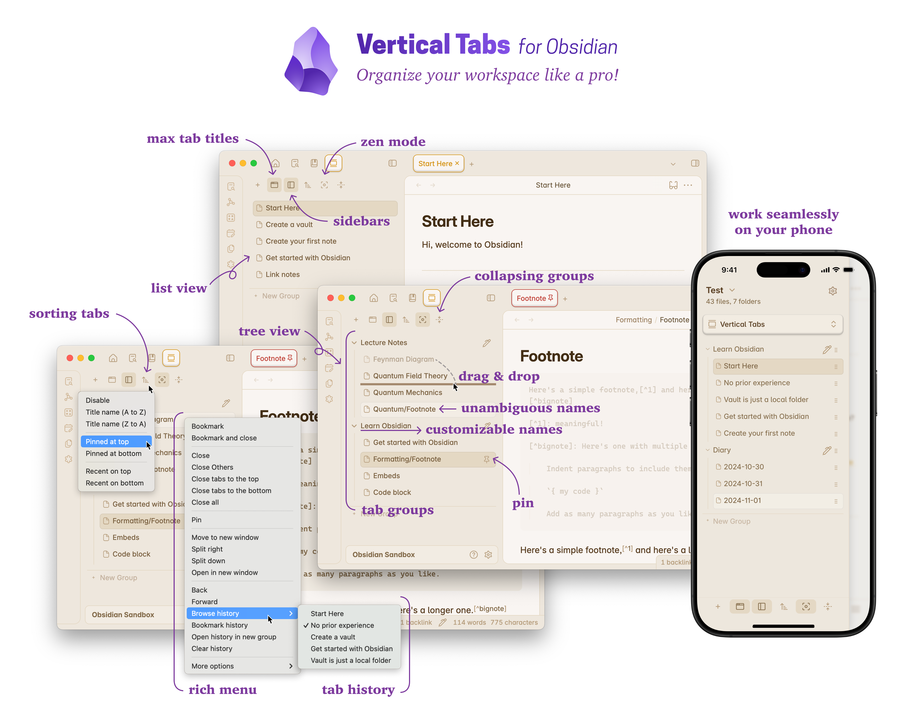

# Vertical Tabs *for Obsidian*

Productive users of Obsidian often find themselves juggling a large number of open notes, and the default horizontal tab layout can make it challenging to locate and switch between them. As more notes are opened, tabs become narrower, making titles harder to read. *Vertical Tabs* offers a solution by introducing a vertical tab view, allowing users to group and organize tabs for more efficient navigation.

As **THE** workspace manager for Obsidian, it provides many handy features like *Per-Tab Zooming*, *Zen Mode*, *Tab History Browser*, and an *Extended Keyboard Tab Switcher*. Additionally, it supports *Advanced Tab Navigation* with customizable presets, such as IDE mode, which delivers a VSCode-like experience with ephemeral tabs and automatic tab deduplication. Users can also create personalized tab navigation strategies for finer control.

  
  
  
  

