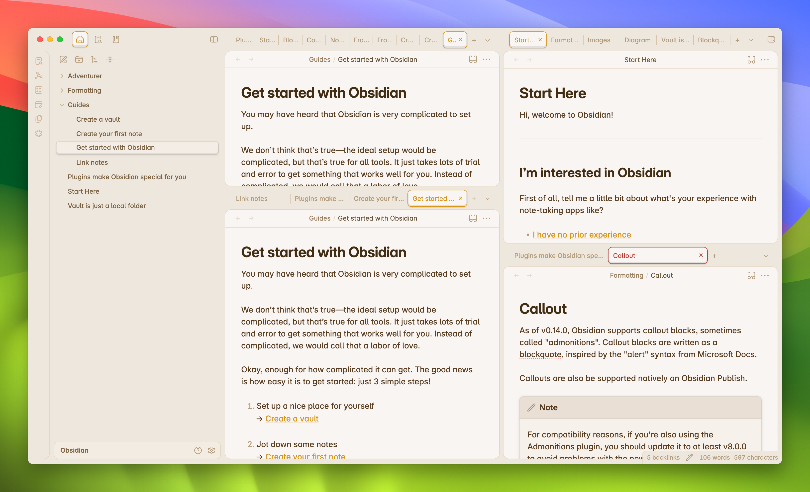
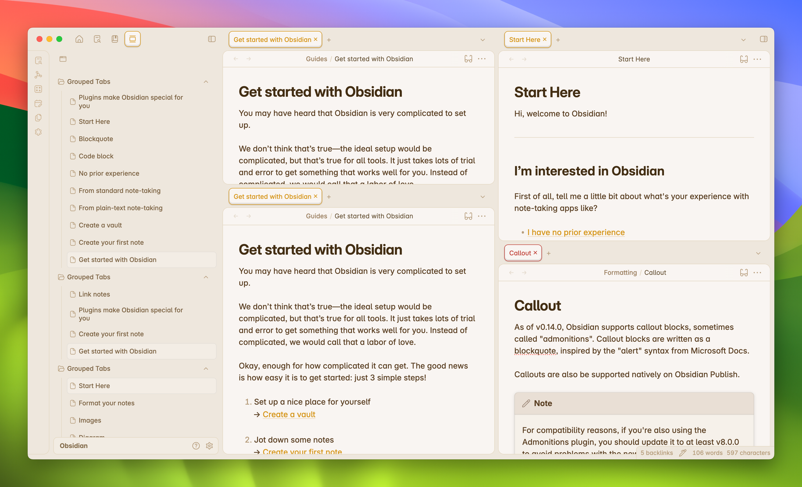
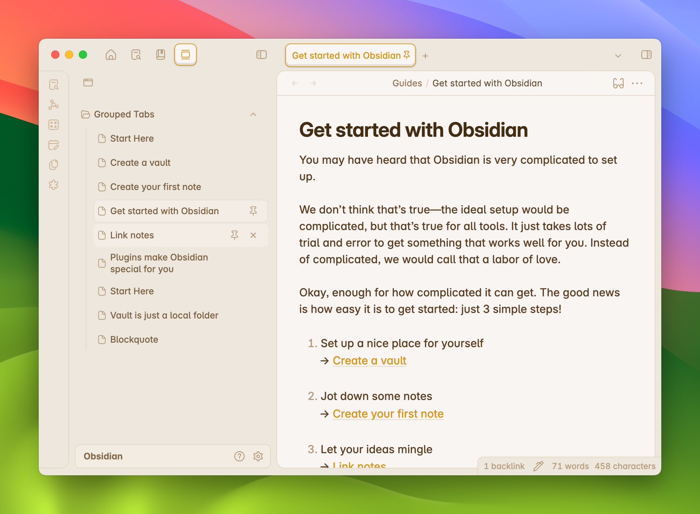

# (Yet Another) Obsidian Vertical Tabs

## Description

Productive users of Obsidian may find themselves with a large number of open notes. The default horizontal tab layout can make it difficult to quickly find and switch between notes,

The tabs are becoming narrower and narrower as more notes are opened, making it difficult to read the note titles. This plugin provides an alternative vertical tab layout that is more space-efficient and easier to navigate,

## Features

**Vertical Tabs**:

How to enable vertical tabs:
- Go to `Settings` -> `Community Plugins` -> `Enable vertical tabs`
- Open the command palette and run `Vertical Tabs: Open vertical tabs`

**Pin/Unpin Tabs**:

